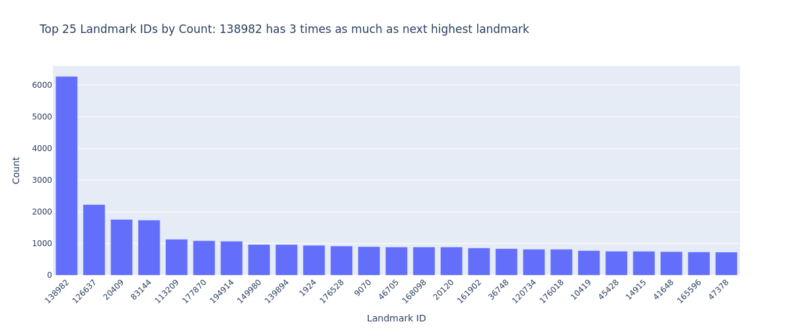
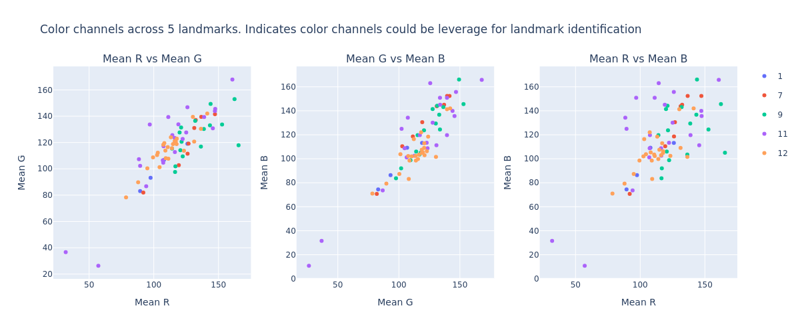
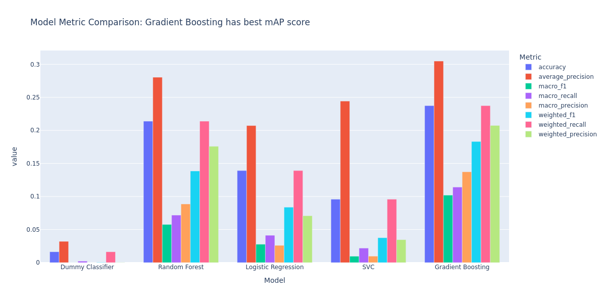

# Landmarks

A repository focused on landmark recognition and retrieval.

## Table of Contents

- [Link to notebooks](#link-to-notebooks)
- [Repository Structure](#repository-structure)
- [Local Installation](#local-installation)
- [About the Dataset](#about-the-dataset)
- [Why is this important? (Business Understanding)](#why-is-this-important-business-understanding)
- [Data Extraction Process](#data-extraction-process)
    - [Image Stats](#image-stats)
    - [Embeddings](#embeddings)
    - [Embeddings 2D](#embeddings-2d)
    - [Local Binary Pattern](#local-binary-pattern)
    - [Parquet over CSV](#parquet-over-csv)
    - [IMPORTANT NOTE](#important-note)
- [Exploratory Data Analysis](#exploratory-data-analysis)
    - [Landmarks](#landmarks)
    - [Aspect Ratio](#aspect-ratio)
    - [Mean RGB](#mean-rgb)
    - [Local Binary Pattern Mean](#local-binary-pattern-mean)
    - [Embedding 2 Dimensions](#embedding-2-dimensions)
- [Base Model Analysis](#base-model-analysis)
    - [ML Flow](#ml-flow)
    - [Base model comparison (Traditional ML Models)](#base-model-comparison-traditional-ml-models)
    - [Feature Importance](#feature-importance)
- [Next Steps / Recommendations](#next-steps--recommendations)

## Link to notebooks

[Data Extraction Notebook](https://github.com/mattdabit/landmarks/blob/main/data_extraction.ipynb)

[EDA Notebook](https://github.com/mattdabit/landmarks/blob/main/eda.ipynb)

## Repository Structure

The repository is organized into several key directories:

- `data/`: Contains all dataset files and extracted features
- `images/`: Contains all images for EDA
- `data_extraction.ipynb`: Notebook for processing and extracting features from
  images. [Link](https://github.com/mattdabit/landmarks/blob/main/data_extraction.ipynb)
- `eda.ipynb`: Notebook for analyzing features. [Link](https://github.com/mattdabit/landmarks/blob/main/eda.ipynb)

## Local Installation

1. Clone the repository
2. Use a python environment manager. I prefer conda.
3. Create and activate conda environment
    ```
    conda env create -f environment.yml   
    conda activate landmark
    ```

## About the Dataset

The dataset was procured from
the [Google Landmark Retrieval 2021
](https://www.kaggle.com/competitions/landmark-retrieval-2021/overview) kaggle competition.
The dataset contains over 1.5 million images and is over 100GB of data.
The purpose of the competition is to develop a model that can efficiently fetch landmark images.

## Why is this important? (Business Understanding)

Image similarity, detection and retrieval are an important problem in computer vision. If you have a program that can
decipher what it is looking at, then other possibilities will open up. In this project I am working on landmark
recognition, and the same models I create for this project can be applied to a variety of problems. For this project,
imagine an app that gives recommendations to nearby landmarks based on the photos you upload during your vacation. In a
different context, imagine a clothing company finding that shirt you saw on the street but could not find in a store.
This would be helpful for a clothing company trying to attract customers. If a machine can detect the similarity, then
we
can even use it for security ala facial recognition. The possibilities with image recognition are endless,
without image recognition you can say goodbye to facial recognition, fast toll booths that photograph your license
plate, early wildfire detection with satellite images and much more.

## Data Extraction Process

The data extraction code processes the landmark images to create parquet files containing extracted features:

### Image Stats

Basic details of the image
1. Height
2. Width
3. Aspect Ratio
4. Mean RGB

### Embeddings

1. An Embedding of an image is a numeric vector that captures the content of the image (shape, textures, objects)
    1. I utilized a pre-trained
       model [ResNet-50](https://medium.com/@f.a.reid/image-similarity-using-feature-embeddings-357dc01514f8) from
       the torchvision package.
2. These were quite large and could not be joined to the main dataset. I still will like to leverage these features,
   as I think the dimensionality reduction I do may have lost too much data.

### Embeddings 2D
1. After noticing the size of the embedding files, I knew I had to reduce the amount of data I had for training.
2. I used a technique called t-distributed stochastic neighbor embedding, which reduces data to two points.
3. As we will see in the EDA, the values produced
   by [t-SNE](https://en.wikipedia.org/wiki/T-distributed_stochastic_neighbor_embedding) distinguished models into
   clusters.

### Local Binary Pattern
1. [LBP](https://en.wikipedia.org/wiki/Local_binary_patterns) is a texture descriptor. It does this by comparing a
   pixel to its neighboring pixels. It captures the
   intensity
   of each pixel and compares their intensities. It will assign 1 if the neighboring pixel's intensity is greater
   than the pixel currently being assessed. Otherwise, LBP will assign 0. The algorithm then combines the binary
   values of all the neighboring pixels to create a value for the pixel being assessed. It does this for all the
   pixels in the image to create a binary code representing the texture of the image.
2. I parallelized this extraction because it was taking too long. Future feature extractions will follow the same
   pattern.

### Parquet over CSV

I chose to create parquets over csvs for space and speed concerns.
Next, I joined all the parquets into 1 for each feature type (excluding embedding).
Finally, I joined all that data into the train csv and produced a new dataset to train on with the features above.

### IMPORTANT NOTE
⚠️IMPORTANT NOTE: The joined_features_all.parquet file, which contains combined features for all landmarks, is not
included in the
repository
due to its large size. This file can be generated locally using the data extraction notebook, however, this process can
take several days.

## Exploratory Data Analysis

There are 81,313 unique landmarks in the dataset. There are 1,580,470 total images. For a portion of this analysis I
took a sample set of unique landmarks to analyze.

### Landmarks



The fact that landmark 138982 has 3 times as many images as the next highest landmark is concerning.
We should keep an eye on that and will likely need to reduce the number of samples from that landmark id.

### Aspect Ratio


Aspect ratio seems like it will not be much of a factor in training. Might be noise, and we should check out the feature
importance of this field.

### Mean RGB


The initial generation of this comparison did not bode well. At this point, I realized that I may be trying to analyze
too much data at once. I decided to pull five unique landmarks and compare their data.

```jupyter
selected_ids = unique_landmarks[:5]
five_landmarks_df = train_df[train_df['landmark_id'].isin(selected_ids)].copy()
```

- Landmark 1


- Landmark 7


- Landmark 9


- Landmark 11


- Landmark 12


The above are the landmarks selected by the above code. Since we are dealing with over 80,000 unique landmarks and over
1.5 million images, I will limit the analysis to a subset of landmarks.



When I compared these 5 unique landmarks and their associated images I found some concetrations and clusters visually in
the scatter plot.
This gave me some hope that mean RGB could be a powerful feature. We may want to transform it more by creation ratios.


It is tough to visualize a 3d plot in 2d. This plot confirmed my above findings. When looking through this 3d plot the
clusters of landmarks became more apparent.

### Local Binary Pattern Mean


Once again I used the 5 unique landmarks. The local binary pattern of an image will generate a vector and assign a value
for each pixel.
This process describes the texture of an image. For this plot, I grouped the data by landmark id and calculated the
average local binary pattern. I then plotted this data.
Here we can see a visually identifiable different between the landmarks for the 12 & 13 bins. If we can extract that
feature and utilize it
for our future models we may see success.

### Embedding 2 Dimensions


In this scatter plot of 2D embeddings, we can clearly see distinct clusters forming for different landmarks, which
suggests that our embedding process has successfully captured the characteristics of the landmarks.


I was so excited about the above finding with 5 landmarks I tried the same process with 25 and found similar results!
This shows embeddings, even when reduced to two dimensions, will be a very strong feature for modeling.

## Base Model Analysis

### ML Flow

I use mlflow for experiment tracking.
Simply run `mlflow ui` to bring up the GUI for MLFlow and see the experiments I ran. Additionally, I log all my metrics
in mlflow.

### Base model comparison (Traditional ML Models)

Earlier experiments showed me that my machine cannot train such a large model with sklearn in a reasonably time. In order
to be pragmatic, I reduce the number of landmarks to train on to 100.
This may prove to not be an issue when I move to use pytorch/tensorflow, as both packages can leverage my GPU.



The traditional machine learning models did performed very well in terms of average precision and provide a solid baseline.
Our target metric for this project is average precision. We see that the Random Forest and Logistic Regression models both
perform the best here.
Now without any tuning, a score of <0.68 in average precision was very exciting. My larger goal will be to move to a deep
learning model
but it may be nice to tune the Random Forest and Logistic Regression models as a comparison

### Feature importance

Evaluating the top features for base models to gain more insight for when we try deep learning models.


Aspect ratio, unexpectedly, was the most important feature. This was a shock to me considering our assesment on the
histogram.
Seeing our embedding and local binary pattern bins in the top ten is very encouraging and supports my understanding of
image similarity detection


I noticed the bin 24 for local binary pattern is also in the top features for Gradient Boosting, like Random Forest. We
also again see our 2D embedding as top features.


The 2D embedding features were the most important for logistic regression. This translated to better
model performance compared to SVC and Gradient Boosting models. Mean color channels were also important to the Logistic Regression
model.


The 2D embedding features were the most important for the SVC model, followed by the the 2D embedding and color
channels.

## Next Steps / Recommendations

1. Handle class imbalance
2. Look into width and height histograms
3. Use full embedding
4. Check out Deep Learning models like CNN
5. Hyperparameters for Random Forest and cross-validation
6. Build average LBP feature 